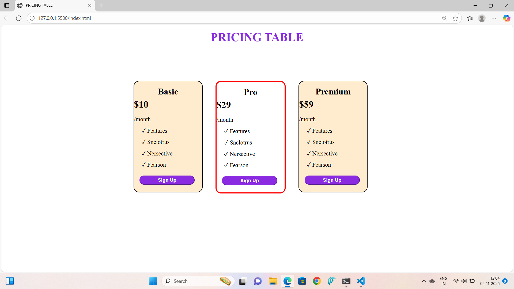

💰 Responsive Pricing Table

A clean, modern, and fully responsive Pricing Table UI built using only HTML and CSS.
Designed to showcase sleek visual presentation, responsive layouts, and attention to UI/UX detail — perfect for portfolios and front-end developer resumes.

🖼️ Screenshots
💻 Desktop View

📱 Mobile View

💡 The layout automatically adapts to all screen sizes, from large desktops to mobile devices, using a mobile-first approach.

🚀 Live Demo

🔗 View Demo:http://127.0.0.1:5500/index.html

✨ Features

💡 Responsive Layout — Perfectly adapts to any device size.

🎨 Modern UI Design — Clean, minimal, and recruiter-friendly.

🧩 3 Pricing Plans — Example plans like Free, Pro, and Enterprise.

⚡ Hover Effects — Interactive animations using pure CSS.

🌈 Customizable — Easy to change colors, fonts, and plan details.

♿ Accessible Markup — Built with semantic HTML for better accessibility.

🔍 Highlight Plan Option — “Most Popular” or “Recommended” plan styling.

🧠 What I Learned

While building this project, I practiced:

Responsive design principles with Flexbox and CSS Grid.

Writing clean and reusable CSS using custom variables.

Crafting user-friendly layouts that emphasize clarity and simplicity.

Managing visual hierarchy through typography and spacing.

🛠️ Built With

HTML5 – Semantic structure

CSS3 – Flexbox, Grid, Transitions, Variables

(No frameworks or libraries used — 100% handcrafted)

🧩 Use Cases

You can use this pricing table component for:

SaaS product landing pages

Portfolio websites

Web design practice projects

UI/UX case studies

💼 Why Recruiters Will Love It

This project demonstrates your:

Attention to design detail

Responsive web design ability

Understanding of semantic, maintainable code structure

Front-end creativity with minimal dependencies

Recruiters often look for visual polish + technical simplicity.
A pricing table project is a perfect showcase of layout skills.

📸 Screenshots

screenshots/
├── desktop-priceop.png
└── mobile-priceop.png
💻 Desktop View

A clean and modern layout with neatly aligned pricing cards, hover effects, and a highlighted “Most Popular” plan for better visual hierarchy.

📱 Tablet View

Perfectly responsive on tablet devices — the pricing cards stack neatly and maintain consistent spacing and readability.

📱 Mobile View

Optimized for mobile-first design. Each pricing plan card appears stacked vertically with clean typography and CTA buttons for easy tap interaction.

🧾 How to Run Locally

Clone this repository

git clone https://github.com/ankithakanneboina/pricing-table.git

Open index.html in your browser

That’s it! No extra setup required 🎉

🪪 License

This project is open-source and available under the MIT License.

❤️ Show Your Support

If you like this project, don’t forget to ⭐ the repository — it really helps!
